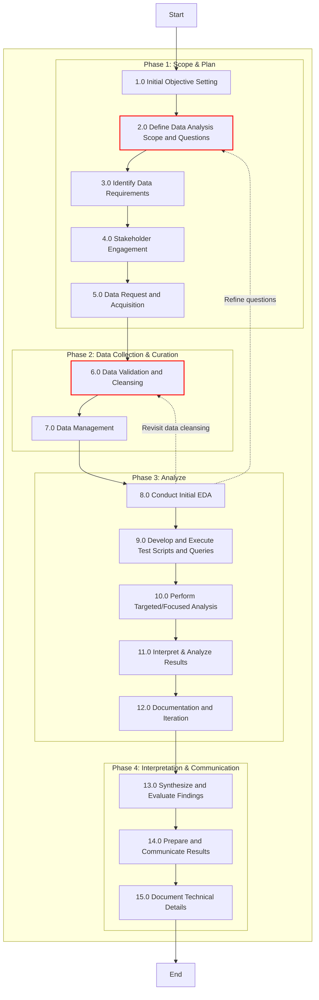

# Applying Data Analysis in Internal Audit

This repository contains resources and examples for applying data analysis techniques in internal auditing. It aims to bridge the gap between data analysis theory and practical application in the field of internal audit including code examples, data sets and visualizations.

## Methodology
1. [Phase 1 - Scope & Plan](./methodology/phase1.md)
2. ...

## Workflow

## Contents

1. [Introduction](./guide/01_introduction.md)
2. [Definitions](./guide/02_definitions.md)
3. [Confirmatory vs. Exploratory Approaches](./guide/03_confirmatory_exploratory_approaches.md)
4. [Causal vs. Non-Causal Analysis](./guide/04_causal-vs-non-causal.md)
5. [Application Examples](./guide/05_application_examples.md)
    - Expense Report Auditing
    - Inventory Management Auditing
    - High-Value Transactions Auditing
6. [Exploratory Data Analysis (EDA) in Auditing](./guide/06_eda_in_auditing.md)
7. [Value of Exploratory and Non-Causal Approaches](./guide/07_value_of_approaches.md)
8. [Conclusion](./guide/08_conclusion.md)
9. [References](./guide/09_references.md)

## About This Project

This project explores the application of data analysis techniques in internal auditing, adapting key concepts from academic research methodologies to the practical world of internal audit. It focuses on two distinct concepts:

- Confirmatory vs. Exploratory Questions
- Causal vs. Non-Causal Questions

This repository will include examples with generated or anonymized real-life data, Python code for analysis and visualization.

## Contact

For questions or feedback, please open an issue in this repository.

---

tags: #data_analysis
