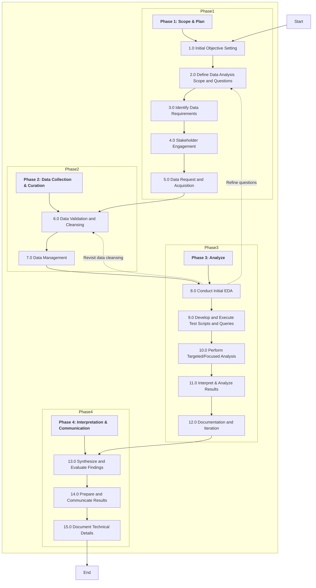

# Applying Data Analysis in Internal Audit

The application of data analysis in internal audit has been a topic of increasing interest and discussion in my recent months. While numerous knowledge briefs and guides are available from respected organizations like the IIA[^1] and ISACA[^2][^3][^4], these resources often present a more high-level and generic approach. As a professional with a background in data science, I've found that many existing resources in this area lack some depth and specificity to better bridge the gap between data analysis theory and its practical application in internal audit.

This observation has motivated me to create this comprehensive repository containing resources and examples for applying data analysis techniques in internal auditing. It aims to bridge the gap between data analysis theory and practical application in the field of internal audit including code examples, data sets and visualizations.

## Methodology
1. [Phase 1 - Scope & Plan](./methodology/phase1.md)
2. [Phase 2 - Data Collection & Curation](./methodology/phase2.md)
3. [Phase 3 - Analyze](./methodology/phase3.md)
4. [Phase 4 - Interpretation & Communication](./methodology/phase4.md)

## Workflow

## Available Guides
- [Methodology](./methodology/00_methodology.md)
	- An overview of the approach I've implemented for audit preparation and data analysis activities based on the following concepts: CRISP-DM[^5] framework and Seven Steps to Empowerment With Data Analytics[^3]

- [2.0 Formulate initial questions and hypotheses](./methodology/2.0_define_da_questions/00_define_da_questions.md)
	- This guide explores the application of data analysis techniques in internal auditing, adapting key concepts from academic research methodologies[^6] to the practical world of internal audit focusing on two distinct concepts:
		- Confirmatory vs. Exploratory Questions
		- Causal vs. Non-Causal Questions

## Additional Resources
- NIST Exploratory Data Analysis: https://www.itl.nist.gov/div898/handbook/index.htm
- Altair Visualization Curriculum: https://idl.uw.edu/visualization-curriculum/intro.html
- Data Storytelling & Communication Cheat Sheet: https://www.datacamp.com/cheat-sheet/data-storytelling-and-communication-cheat-sheet

## Contact

For questions or feedback, please open an issue in this repository.

---

tags: #data_analysis #audit

[^1]: IIA Knowledge Briefs: Data Analytics, Parts 1-3. https://www.theiia.org/en/content/articles/global-perspectives-and-insights/2023/GlobalPerspectivesInsightsDataAnalyticsParts1-3/

[^2]: Internal Audit Data Analytics for Beginners. https://www.isaca.org/resources/news-and-trends/industry-news/2023/internal-audit-data-analytics-for-beginners

[^3]: Seven Steps to Empowerment With Data Analytics. https://www.isaca.org/resources/news-and-trends/newsletters/atisaca/2023/volume-34/seven-steps-to-empowerment-with-data-analytics

[^5]: CRISP-DM 1.0: Step-by-step data mining guide.
https://www.semanticscholar.org/paper/CRISP-DM-1.0:-Step-by-step-data-mining-guide-Chapman/54bad20bbc7938991bf34f86dde0babfbd2d5a72

[^4]: Advanced Data Analytics for IT Auditors. https://www.isaca.org/resources/isaca-journal/issues/2016/volume-6/advanced-data-analytics-for-it-auditors

[^6]: Card, D., Min, Y., & Serghiou, S. (2021, December 14). Open, rigorous and reproducible research: A practitioner's handbook. Stanford Data Science. https://stanforddatascience.github.io

