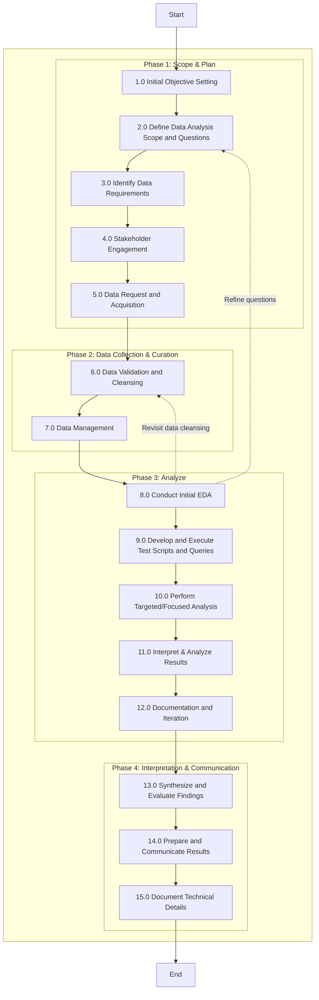

# Applying Data Analysis in Internal Audit

This repository is an early-stage practical guide for applying data analysis in internal audit. It focuses on the step that is often weak in audit analytics work: translating audit objectives, risks, and controls into answerable analytical questions, data requirements, reproducible tests, and communicable results.

The project currently contains methodology notes and practical guidance. Planned additions include synthetic datasets, Python notebooks, reusable templates, and visualizations.

## Status

Current maturity: early-stage methodology guide.

What exists now:
- A four-phase methodology for audit analytics work.
- A workflow from audit objective setting to communication of results.
- Guidance on formulating confirmatory, exploratory, causal, and non-causal questions.
- Decision gates for deciding whether data analysis is worth pursuing in a specific audit context.
- Reproducibility, evidence-strength, and confidentiality guidance.
- Initial templates and a worked example structure.

Planned next additions:
- Synthetic audit datasets.
- Python examples and notebooks.
- Reusable data quality checks.
- Example visualizations.
- More end-to-end worked examples.

## Methodology

1. [Phase 1 - Scope & Plan](./methodology/phase1.md)
2. [Phase 2 - Data Collection & Curation](./methodology/phase2.md)
3. [Phase 3 - Analyze](./methodology/phase3.md)
4. [Phase 4 - Interpretation & Communication](./methodology/phase4.md)

Supporting guides:
- [Methodology overview](./methodology/00_methodology.md)
- [Analytics decision gate](./methodology/analytics_decision_gate.md)
- [Formulating initial questions and hypotheses](./methodology/2.0_define_da_questions/00_define_da_questions.md)
- [Data governance and reproducibility](./methodology/data_governance_reproducibility.md)
- [Evidence strength and reporting threshold](./methodology/evidence_strength.md)

## Workflow

```mermaid
flowchart TB
    A[Start]
    F[End]

    subgraph workflow [" "]
        direction TB
        subgraph Phase1["Phase 1: Scope & Plan"]
            direction TB
            B1[1.0 Initial Objective Setting]
            B2[2.0 Define Data Analysis Scope and Questions]
            B3[3.0 Identify Data Requirements]
            B4[4.0 Stakeholder Engagement]
            B5[5.0 Data Request and Acquisition]
            B1 --> B2 --> B3 --> B4 --> B5
        end

        subgraph Phase2["Phase 2: Data Collection & Curation"]
            direction TB
            C1[6.0 Data Validation and Cleansing]
            C2[7.0 Data Management]
            C1 --> C2
        end

        subgraph Phase3["Phase 3: Analyze"]
            direction TB
            D1[8.0 Conduct Initial EDA]
            D2[9.0 Develop and Execute Test Scripts and Queries]
            D3[10.0 Perform Targeted/Focused Analysis]
            D4[11.0 Interpret & Analyze Results]
            D5[12.0 Documentation and Iteration]
            D1 --> D2 --> D3 --> D4 --> D5
        end

        subgraph Phase4["Phase 4: Interpretation & Communication"]
            direction TB
            E1[13.0 Synthesize and Evaluate Findings]
            E2[14.0 Prepare and Communicate Results]
            E3[15.0 Document Technical Details]
            E1 --> E2 --> E3
        end
    end

    A --> B1
    B5 --> C1
    C2 --> D1
    D5 --> E1
    E3 --> F

    D1 -.-> |Refine questions| B2
    D1 -.-> |Revisit data cleansing| C1
```

## Practical templates

- [Data requirements checklist](./templates/data_requirements_checklist.md)
- [Data quality checklist](./templates/data_quality_checklist.md)
- [Analysis log template](./templates/analysis_log_template.md)
- [Finding evidence mapping template](./templates/finding_evidence_mapping.md)

## Worked examples

- [High-value transaction approval testing](./examples/high_value_transaction_approval_testing.md)

## Design principles

- Start from audit objectives, risks, and controls, not from available data alone.
- Distinguish exploratory patterns from reportable audit evidence.
- Use data analysis where it improves assurance, insight, or efficiency.
- Make transformations and assumptions reproducible.
- Treat confidentiality, data minimization, and retention as audit analytics requirements, not afterthoughts.
- Keep the auditor responsible for judgment, interpretation, and reporting.

## Additional resources

- NIST Exploratory Data Analysis: https://www.itl.nist.gov/div898/handbook/index.htm
- University of Washington Visualization Curriculum: https://idl.uw.edu/visualization-curriculum/
- The seaborn.objects interface: https://seaborn.pydata.org/tutorial/objects_interface.html
- IIA Knowledge Briefs: Data Analytics, Parts 1-3[^1]
- ISACA: Internal Audit Data Analytics for Beginners[^2]
- ISACA: Seven Steps to Empowerment With Data Analytics[^3]
- ISACA Journal: Advanced Data Analytics for IT Auditors[^4]
- CRISP-DM 1.0[^5]
- Stanford Data Science: Open, rigorous and reproducible research[^6]

## Contact

For questions or feedback, please open an issue in this repository.

---

tags: #data_analysis #audit

[^1]: IIA Knowledge Briefs: Data Analytics, Parts 1-3. https://www.theiia.org/en/content/articles/global-perspectives-and-insights/2023/GlobalPerspectivesInsightsDataAnalyticsParts1-3/

[^2]: Internal Audit Data Analytics for Beginners. https://www.isaca.org/resources/news-and-trends/industry-news/2023/internal-audit-data-analytics-for-beginners

[^3]: Seven Steps to Empowerment With Data Analytics. https://www.isaca.org/resources/news-and-trends/newsletters/atisaca/2023/volume-34/seven-steps-to-empowerment-with-data-analytics

[^4]: Advanced Data Analytics for IT Auditors. https://www.isaca.org/resources/isaca-journal/issues/2016/volume-6/advanced-data-analytics-for-it-auditors

[^5]: CRISP-DM 1.0: Step-by-step data mining guide. https://www.semanticscholar.org/paper/CRISP-DM-1.0:-Step-by-step-data-mining-guide-Chapman/54bad20bbc7938991bf34f86dde0babfbd2d5a72

[^6]: Card, D., Min, Y., & Serghiou, S. (2021, December 14). Open, rigorous and reproducible research: A practitioner's handbook. Stanford Data Science. https://stanforddatascience.github.io
